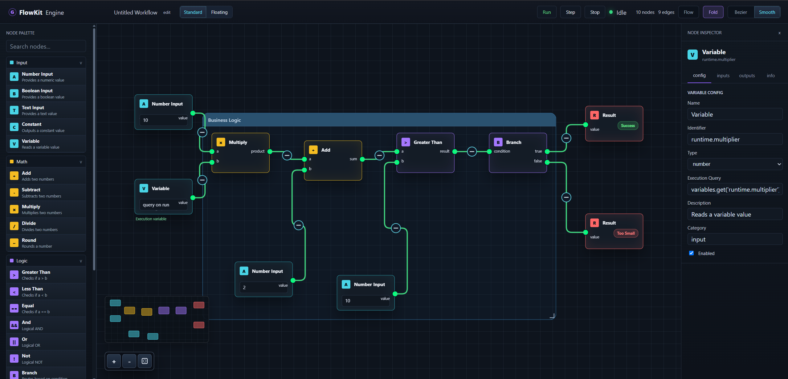
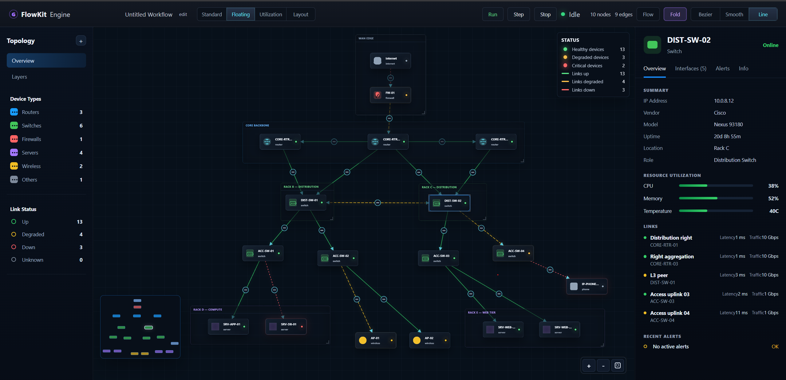

# FlowKit

<p align="center">
  
</p>

<p align="center">
  <a href="https://github.com/Tmarndt1/FlowKit/actions/workflows/ci.yml"></a>
  <a href="./LICENSE"></a>
</p>

<p align="center">
  A React + TypeScript library for building node editors, workflow designers, network diagrams, and flow-based applications.
</p>

---

## Overview

FlowKit provides the building blocks for interactive node-based experiences in React. It aims to include common graph-editor capabilities in the library itself, while keeping rendering, styling, and state ownership flexible for application teams.

Use it for workflow engines, automation builders, network topology editors, ETL pipelines, visual scripting tools, and low-code interfaces.

---

## Features

### Canvas

* Pannable and zoomable workspace
* Grid backgrounds and grid snapping
* Recenter and zoom controls
* Read-only mode for non-editable diagrams
* Minimap with custom node styles
* Controlled node, edge, and container data

### Nodes

* Draggable nodes
* Custom React node renderers
* Fixed endpoint connections
* Floating node-bound connections
* Selection state
* Group containers with draggable membership
* Optional container resize-to-fit behavior
* Custom container renderers via `containerTypes`
* State classes for fold preview and hidden nodes

### Edges

* Bezier, smooth-step, step, and straight paths
* Built-in route shaping for node avoidance and parallel edge offsets
* Optional animated flow paths
* Marker shapes at either end: arrow, open arrow, hollow triangle, filled diamond, hollow diamond
* Solid, dashed, or dotted stroke styles
* Midpoint edge labels
* Custom edge renderers
* Edge selection
* Collapsible edge controls
* Upstream, downstream, both-sides, or connection-only folding

### Events

* Normalized `NodeChange` and `EdgeChange` descriptors for position, selection, dimensions, and connections
* Container membership change callback

### Customization

* CSS class hooks for nodes, edges, endpoints, controls, minimap, and containers
* CSS variables for common colors
* Per-edge path type, animation, collapse, markers, stroke style, and inline styles
* Custom node, edge, and container component maps
* Public helper for advanced fold-state derivation

---

## Installation

```bash
npm install flowkit
```

FlowKit lists React 19 as a peer dependency, so make sure `react` is installed in your app.

Import the components you need and FlowKit's stylesheet once at your app entry point:

```tsx
import { FlowKit } from "flowkit";
import "flowkit/styles.css";
```

The default styles are intended as a starting point — override the CSS class hooks (see [Styling](#styling)) to match your design.

---

## Basic Usage

```tsx
import {
  FlowKit,
  FlowKitControls,
  FlowKitEvents,
  FlowKitGrid,
  FlowKitGridSnap,
  IEdge,
  INode,
  Position,
} from "flowkit";

const nodes: INode<any, any>[] = [
  {
    key: "input",
    type: "node",
    offset: { x: 80, y: 80 },
    endpoints: [{ id: "input-out", offset: { x: 120, y: 20 }, position: Position.Right }],
  },
  {
    key: "result",
    type: "node",
    offset: { x: 360, y: 80 },
    endpoints: [{ id: "result-in", offset: { x: 0, y: 20 }, position: Position.Left }],
  },
];

const edges: IEdge<any>[] = [
  {
    key: "edge-input-result",
    type: "edge",
    sourceId: "input-out",
    targetId: "result-in",
    arrows: "target",
  },
];

export function App() {
  return (
    <FlowKit nodes={nodes} edges={edges} edgePathType="smooth-step" centerOnLoad>
      <FlowKitGrid size={32} />
      <FlowKitControls />
      <FlowKitEvents />
      <FlowKitGridSnap size={24} />
    </FlowKit>
  );
}
```

### `FlowKitProps`

| Prop | Type | Description |
|------|------|-------------|
| `nodes` | `INode<any, any>[]` | Nodes to render (controlled application state) |
| `edges` | `IEdge<any>[]` | Edges to render (controlled application state) |
| `containers` | `INodeContainer[]?` | Optional group containers rendered behind nodes |
| `nodeTypes` | `NodeTypes?` | Custom node renderer map, keyed by `node.type` |
| `edgeTypes` | `EdgeTypes?` | Custom edge renderer map, keyed by `edge.type` |
| `containerTypes` | `ContainerTypes?` | Custom container renderer map, keyed by `container.type` |
| `style` | `React.CSSProperties?` | Inline style for the root element |
| `zoomMin` / `zoomMax` | `number?` | Zoom scale bounds |
| `centerOnLoad` | `boolean?` | Centers the initial viewport around rendered content |
| `proximityConnect` | `boolean \| ProximityConnectOptions?` | Endpoint proximity snapping while creating connections |
| `customNodeProps` | `NodeComponentProps?` | Extra props passed to custom node renderers |
| `collapsibleEdges` | `boolean?` | Enables built-in edge fold controls by default |
| `edgePathType` | `EdgePathType?` | Default edge path algorithm |
| `edgeRouting` | `EdgeRoutingOptions?` | Default route shaping for edges |
| `readOnly` | `boolean?` | Disables editing while preserving pan, zoom, and selection |
| `multiSelect` | `boolean?` | Multi-selection via modifier-click and marquee (default `true`) |
| `onEdgeCollapsedChange` | `(args) => void?` | Fold control requested a collapse state change |
| `onEdgeCollapsePreviewChange` | `(args) => void?` | Fold menu option previewed or cleared |
| `canConnect` | `CanConnect?` | Validator for new endpoint connections |

### Connection validation

Pass `canConnect` to reject invalid connections while the user drags. Endpoints highlight green or red immediately based on the result.

```tsx
<FlowKit
  nodes={nodes}
  edges={edges}
  canConnect={({ source, target }) => source.data?.valueType === target.data?.valueType}
/>
```

---

## Floating Edges

Floating edges connect to node bounds instead of fixed endpoint elements. Use `anchorMode: "floating"` and pass node keys as `sourceId` and `targetId`.



```ts
const edge = {
  key: "edge-router-switch",
  type: "edge",
  anchorMode: "floating",
  sourceId: "router",
  targetId: "switch",
  arrows: "target",
};
```

FlowKit measures the source and target nodes and chooses the side of each node that faces the other node. When nodes are dragged, the anchors update automatically.

If your data model still needs endpoint ids, provide explicit node ids:

```ts
const edge = {
  key: "edge-port-port",
  type: "edge",
  anchorMode: "floating",
  sourceId: "router-port-a",
  targetId: "switch-port-b",
  sourceNodeId: "router",
  targetNodeId: "switch",
};
```

---

## Presets

FlowKit ships optional preset node libraries for common starting points. The core canvas stays generic; presets provide reusable node definitions, renderers, and creation helpers.

### Workflow

```tsx
import {
  FlowKit,
  createWorkflowNode,
  workflowNodeTypes,
} from "flowkit";

const nodes = [
  createWorkflowNode("number-input", "number-a", { x: 80, y: 120 }, { value: "10" }),
  createWorkflowNode("logic-if-else", "if-else", { x: 360, y: 120 }),
  createWorkflowNode("logic-switch", "switch-case", { x: 640, y: 120 }),
  createWorkflowNode("policy-decision-table", "decision-table", { x: 920, y: 120 }),
];

export function Workflow() {
  return <FlowKit nodes={nodes} edges={[]} nodeTypes={workflowNodeTypes} />;
}
```

### Shapes

```tsx
import { FlowKit, createShapeNode, shapeNodeTypes } from "flowkit";

const nodes = [
  createShapeNode("diamond", "decision", { x: 100, y: 100 }),
  createShapeNode("square", "task", { x: 320, y: 100 }),
];

export function Diagram() {
  return <FlowKit nodes={nodes} edges={[]} nodeTypes={shapeNodeTypes} />;
}
```

---

## Collapsible Edges

Enable built-in folding with `collapsibleEdges`. FlowKit renders a control at the middle of each edge and supports connection-only, downstream, upstream, and both-side collapse modes.

```tsx
<FlowKit
  nodes={nodes}
  edges={edges}
  collapsibleEdges
  onEdgeCollapsedChange={({ edge, collapsed, mode }) => {
    setEdges((current) =>
      current.map((item) =>
        item.key === edge.key
          ? { ...item, collapsed, collapseMode: collapsed ? mode : undefined }
          : item
      )
    );
  }}
/>
```

FlowKit derives affected nodes and edges internally. Apps only need to persist `edge.collapsed` and `edge.collapseMode` when they want controlled state.

Useful state classes:

* `.flow-kit-node-fold-preview`
* `.flow-kit-node-hidden`
* `.flow-kit-edge-fold-preview`
* `.flow-kit-edge-path.flow-kit-folded`
* `.flow-kit-edge-path.flow-kit-fold-stub`

For advanced integrations, `getFoldGraphState` is exported.

---

## Containers

Containers are visual groups that wrap a set of nodes. They resize around their assigned nodes by default. Disable that behavior per container to keep a fixed size after nodes are dragged in or out.

```ts
const containers: INodeContainer[] = [
  {
    key: "rack-a",
    label: "Rack A",
    nodeKeys: ["router", "switch"],
    resizeToFit: false,
    style: { width: 400, height: 300, minWidth: 200, minHeight: 120 },
    className: "my-custom-container",
  },
];
```

When `resizeToFit` is `false`, FlowKit preserves the rendered container position and size during membership changes. Users can still move or manually resize the container unless `readOnly` is enabled. Resizing is clamped so the container cannot be made smaller than its currently contained nodes.

### `INodeContainer` fields

| Field | Type | Description |
|-------|------|-------------|
| `key` | `string` | Stable identifier |
| `label` | `string?` | Header text in the built-in renderer |
| `type` | `string?` | Selects a custom renderer from `containerTypes` |
| `nodeKeys` | `string[]` | Node keys assigned to this container |
| `padding` | `number?` | Space between container bounds and contained nodes (default `24`) |
| `resizeToFit` | `boolean?` | Recalculate bounds from contained nodes after membership changes (default `true`) |
| `position` | `IOffset?` | Canvas-space top-left position. Derived from node bounds when omitted |
| `style` | `React.CSSProperties?` | Inline styles. Use `width`, `height`, `minWidth`, `minHeight` here for explicit dimensions |
| `className` | `string?` | Extra CSS class names applied to the container element |

### Custom container renderers

Register custom container components the same way as `nodeTypes` and `edgeTypes`:

```tsx
import { ContainerTypes, INodeContainer } from "flowkit";

function GroupBox(props: INodeContainer & { className: string; style: React.CSSProperties }) {
  return (
    <div className={props.className} style={props.style}>
      <header>{props.label}</header>
    </div>
  );
}

const containerTypes: ContainerTypes = {
  "group-box": GroupBox,
};
```

Pass the map to `FlowKit` and set `type` on each container that should use it:

```tsx
<FlowKit
  nodes={nodes}
  edges={edges}
  containers={[{ key: "g1", type: "group-box", label: "Group", nodeKeys: ["a", "b"] }]}
  containerTypes={containerTypes}
/>
```

The custom component receives all `INodeContainer` fields plus `className` and `style` as props. The wrapping `div` that handles drag and resize is still managed by FlowKit.

---

## Events

`FlowKitEvents` is a non-visual component placed inside `FlowKit` that forwards canvas interactions to app callbacks.

```tsx
<FlowKit nodes={nodes} edges={edges}>
  <FlowKitEvents
    onNodesChange={(changes) => {
      changes.forEach((change) => {
        if (change.type === "position") {
          setNodes((ns) => ns.map((n) =>
            n.key === change.key ? { ...n, offset: change.offset } : n
          ));
        }
      });
    }}
    onEdgesChange={(changes) => {
      changes.forEach((change) => {
        if (change.type === "connect") {
          setEdges((es) => [...es, {
            key: `edge-${change.sourceId}-${change.targetId}`,
            type: "edge",
            sourceId: change.sourceId,
            targetId: change.targetId,
          }]);
        }
      });
    }}
    onContainersChange={(changes) =>
      setContainers((current) => applyContainerChanges(current, changes))
    }
  />
</FlowKit>
```

`applyContainerChanges` is an exported helper that applies a batch of `ContainerChange` descriptors (move, resize, membership, add, remove) to a container array and returns a new array.

### `FlowKitEventsProps`

| Prop | Type | Description |
|------|------|-------------|
| `onNodesChange` | `(changes: NodeChange[]) => void` | Called when nodes are repositioned, resized, or their selection changes |
| `onEdgesChange` | `(changes: EdgeChange[]) => void` | Called when edges are connected, selected, added, or removed |
| `onContainersChange` | `(changes: ContainerChange[]) => void` | Called with normalized change descriptors when containers are moved, resized, or have membership changes |

### `NodeChange`

```ts
type NodeChange =
  | { type: "position";   key: string; offset: IOffset }
  | { type: "select";     key: string; selected: boolean }
  | { type: "dimensions"; key: string; width: number; height: number }
  | { type: "add";        node: INode<any, any> }
  | { type: "remove";     key: string };
```

`position` fires after a drag completes and includes the final canvas-space offset for every node that moved (the entire multi-selection group when multiple nodes are dragged together). `dimensions` fires when a node's rendered size changes. `select` fires for every node whose selection status changed in the most recent interaction.

### `EdgeChange`

```ts
type EdgeChange =
  | { type: "connect"; sourceId: string; targetId: string }
  | { type: "select";  key: string; selected: boolean }
  | { type: "add";     edge: IEdge<any> }
  | { type: "remove";  key: string };
```

`connect` replaces the old `onConnect` callback. It fires when the user successfully drops an endpoint onto a compatible target. `select` mirrors the node variant.

### `ContainerChange`

```ts
type ContainerChange =
  | { type: "move";       key: string; position: IOffset }
  | { type: "resize";     key: string; position: IOffset; width: number; height: number }
  | { type: "membership"; key: string; nodeKeys: string[] }
  | { type: "add";        container: INodeContainer }
  | { type: "remove";     key: string };
```

### Selection hook

For components rendered inside `FlowKit` that need the legacy selected/unselected pattern, `useNodeFlowSelectionChange` is still exported:

```tsx
import { useNodeFlowSelectionChange } from "flowkit";

function SelectionListener() {
  useNodeFlowSelectionChange(
    (element) => console.log("selected", element),
    (element) => console.log("unselected", element),
  );
  return null;
}
```

---

## Auto Layout

FlowKit ships layout algorithms that reposition nodes programmatically. Call them with your current nodes and edges, apply the result, then call `notifyLayout()` on the FlowKit ref to redraw edges at their new positions.

```tsx
import * as React from "react";
import {
  FlowKit,
  FlowKitHandle,
  hierarchicalLayout,
  forceLayout,
  toLayoutNodes,
  toLayoutEdges,
  applyLayout,
} from "flowkit";

export function AutoLayout() {
  const flowRef = React.useRef<FlowKitHandle>(null);
  const [nodes, setNodes] = React.useState(initialNodes);

  const applyHierarchical = () => {
    const result = hierarchicalLayout(
      toLayoutNodes(nodes),
      toLayoutEdges(edges),
      { direction: "TB", rankSpacing: 80, nodeSpacing: 40 }
    );
    setNodes(applyLayout(nodes, result));
    flowRef.current?.notifyLayout();
  };

  return (
    <FlowKit ref={flowRef} nodes={nodes} edges={edges}>
      <FlowKitControls />
    </FlowKit>
  );
}
```

### Available algorithms

**`hierarchicalLayout(nodes, edges, options?)`** — ranks nodes by topological order and arranges them in rows or columns.

Options:

| Option | Default | Description |
|--------|---------|-------------|
| `direction` | `"TB"` | `"TB"` top-to-bottom, `"LR"` left-to-right, `"BT"` bottom-to-top, `"RL"` right-to-left |
| `rankSpacing` | `80` | Gap between rank layers in pixels |
| `nodeSpacing` | `40` | Gap between nodes within a layer |

**`forceLayout(nodes, edges, options?)`** — physics simulation that spreads nodes apart naturally.

Options:

| Option | Default | Description |
|--------|---------|-------------|
| `iterations` | `300` | Number of simulation steps |
| `repulsion` | `5000` | Force pushing unconnected nodes apart |
| `attraction` | `0.01` | Force pulling connected nodes together |
| `damping` | `0.85` | Velocity damping per step |

### Helper utilities

```ts
toLayoutNodes(nodes)    // Convert INode[] to LayoutNode[] for algorithm input
toLayoutEdges(edges)    // Convert IEdge[] to LayoutEdge[] for algorithm input
applyLayout(nodes, result) // Merge LayoutResult positions back into INode[]
buildAdjacency(nodes, edges) // Build adjacency lists for custom traversals
topoRanks(nodes, edges) // Return topological rank for each node key
placeConnected(nodes, edges, options?) // Place disconnected subgraphs side by side
findFreePosition(nodes, offset?) // Find an unoccupied position on the canvas
```

### `FlowKitHandle`

The imperative ref API exposed by `FlowKit`:

| Method | Description |
|--------|-------------|
| `recenter()` | Pan and zoom to fit all nodes |
| `panToNode(key, options?)` | Pan the viewport so the node with the given key is centered. Returns `false` when the node cannot be found |
| `zoomIn()` | Increase zoom level |
| `zoomOut()` | Decrease zoom level |
| `notifyLayout()` | Redraw all edges after programmatic node repositioning |

---

## Read-Only Mode

Set `readOnly` when the diagram should be inspectable but not editable.

```tsx
<FlowKit nodes={nodes} edges={edges} readOnly>
  <FlowKitGrid />
  <FlowKitControls />
  <FlowKitEvents />
</FlowKit>
```

Read-only mode preserves pan, zoom, recenter, node/edge selection, minimaps, legends, and labels. It disables node dragging, container dragging/resizing, endpoint connection creation, edge collapse controls, paste, and keyboard deletion.

---

## Edge Paths And Animation

Set a default path type on `FlowKit`:

```tsx
<FlowKit edgePathType="bezier" />
<FlowKit edgePathType="smooth-step" />
<FlowKit edgePathType="step" />
<FlowKit edgePathType="straight" />
```

Override per edge:

```ts
const edge = {
  key: "edge-a-b",
  type: "edge",
  sourceId: "a-out",
  targetId: "b-in",
  pathType: "smooth-step",
  animated: true,
};
```

Animation is opt-in per edge with `animated: true`.

---

## Edge Markers And Stroke Styles

Attach marker shapes to either end of an edge with `markerStart` and `markerEnd`, and control the dash pattern with `strokeStyle`. Combined with floating anchor mode, this covers UML relationship notation out of the box.

```ts
import { EdgeMarker, EdgeStrokeStyle, IEdge } from "flowkit";

// Inheritance — hollow triangle at the parent end
const inheritance: IEdge<any> = {
  key: "dog-extends-animal",
  type: "edge",
  anchorMode: "floating",
  sourceId: "dog",
  targetId: "animal",
  markerEnd: "hollow-triangle",
};

// Composition — filled diamond at the owner end
const composition: IEdge<any> = {
  key: "order-owns-lines",
  type: "edge",
  anchorMode: "floating",
  sourceId: "order",
  targetId: "order-line",
  markerStart: "filled-diamond",
  markerEnd: "arrow",
};

// Dependency — dashed line with an open arrow
const dependency: IEdge<any> = {
  key: "service-uses-order",
  type: "edge",
  anchorMode: "floating",
  sourceId: "payment-service",
  targetId: "order",
  markerEnd: "open-arrow",
  strokeStyle: "dashed",
  label: "«uses»",
};
```

Available markers (`EdgeMarker`): `"arrow"`, `"open-arrow"`, `"hollow-triangle"`, `"filled-diamond"`, `"hollow-diamond"`, `"none"`.

Available stroke styles (`EdgeStrokeStyle`): `"solid"` (default), `"dashed"`, `"dotted"`.

`markerStart`/`markerEnd` take precedence over the legacy `arrows` prop, which continues to work for simple source/target arrowheads. Marker colors follow `--flow-kit-edge-arrow-color`; hollow marker fill follows `--flow-kit-edge-marker-hollow-fill`.

Set `label` on any edge to render text at the path midpoint.

---

## Edge Routing

Use `edgeRouting` to shape built-in edge paths when diagrams get dense.

```tsx
<FlowKit
  nodes={nodes}
  edges={edges}
  edgePathType="smooth-step"
  edgeRouting={{
    avoidNodes: true,
    parallelOffset: 18,
  }}
/>
```

Available options:

* `avoidNodes`: routes edges around rendered node bounds when possible. This is strongest with `smooth-step` and `step` paths, and uses a conservative curved detour for Bezier paths.
* `parallelOffset`: fans out multiple edges that connect the same source/target node pair.

Override per edge:

```ts
const edge = {
  key: "edge-a-b",
  type: "edge",
  sourceId: "a",
  targetId: "b",
  routing: {
    avoidNodes: false,
    parallelOffset: 28,
  },
};
```

---

## External Viewport Controls

Use a `FlowKit` ref when controls live outside the canvas, such as topology search results, alert panels, or device tables.

```tsx
import * as React from "react";
import { FlowKit, FlowKitHandle } from "flowkit";

export function TopologyView() {
  const flowRef = React.useRef<FlowKitHandle>(null);

  return (
    <>
      <button onClick={() => flowRef.current?.panToNode("router-01")}>
        Show router
      </button>
      <button onClick={() => flowRef.current?.recenter()}>
        Recenter topology
      </button>

      <FlowKit ref={flowRef} nodes={nodes} edges={edges} />
    </>
  );
}
```

The same controls are available to components rendered inside `FlowKit` through `useFlowKitControls()`.

---

## Selection

FlowKit supports both single and multi-selection out of the box.

* Click a node or edge to select it, replacing the previous selection.
* Hold `Shift`, `Ctrl`, or `Cmd` and click to add or remove a node or edge from the current selection.
* Dragging any selected node moves the whole selection together.

Read the current selection from components rendered inside `FlowKit`:

```tsx
import { useNodeFlowSelectedNodes, useNodeFlowSelectedEdges } from "flowkit";

function SelectionCount() {
  const nodes = useNodeFlowSelectedNodes();
  const edges = useNodeFlowSelectedEdges();

  return <span>{nodes.length} nodes, {edges.length} edges selected</span>;
}
```

`useNodeFlowSelection()` still returns the most recently selected element for single-selection use cases.

Multi-selection is enabled by default. Set `multiSelect={false}` on `FlowKit` to restrict interactions to single selection:

```tsx
<FlowKit nodes={nodes} edges={edges} multiSelect={false} />
```

---

## Endpoints

Endpoints highlight immediately when an edge drag begins — valid targets show green, invalid targets show red — without requiring a hover. The source endpoint retains its default appearance.

Override endpoint appearance:

```tsx
<Endpoint endpoint={ep} className="my-endpoint" style={{ width: 10, height: 10 }} />
```

Relevant CSS hooks:

```css
.flow-kit-endpoint {}
.flow-kit-endpoint-proximity-target {}  /* active during proximity connect */
.flow-kit-endpoint-selected {}          /* endpoint of the selected edge */
```

---

## Styling

FlowKit ships with default CSS classes and expects applications to override them as needed.

Common hooks:

```css
.flow-kit {}
.flow-kit-viewport {}
.flow-kit-node-wrapper {}
.flow-kit-node {}
.flow-kit-endpoint {}
.flow-kit-edge-path {}
.flow-kit-controls {}
.flow-kit-mini-map {}
.flow-kit-node-container {}
.flow-kit-node-container-header {}
.flow-kit-node-container-dragging-out {}
```

Example:

```css
.flow-kit-edge-path {
  stroke: #67e8f9;
  stroke-width: 2.5;
}

.flow-kit-node-hidden {
  opacity: 0;
  pointer-events: none;
}
```

---

## Demo

The demo includes a workflow editor, a floating-edge network diagram, an auto-layout explorer, a volume-utilization dashboard, and a UML class diagram showcasing edge markers.

```bash
npm install
npm run build

cd demo
npm install
npm run dev
```

A developer documentation site with full API reference lives in `docs-site/`:

```bash
cd docs-site
npm install
npm run dev   # http://localhost:5174
```

---

## Testing

Unit tests are written with [Vitest](https://vitest.dev) and cover the pure graph, routing, marker, container, and fold-state logic in `lib/`.

```bash
npm test            # run all tests once
npm run test:watch  # watch mode
npm run typecheck   # TypeScript type checking
```

Tests run automatically on pushes and pull requests via GitHub Actions.

---

## Status

FlowKit is under active development. Planned areas include undo/redo, copy/paste, edge waypoints, multiplicity-style edge end labels, serialization helpers, and image export.

---

## License

MIT
